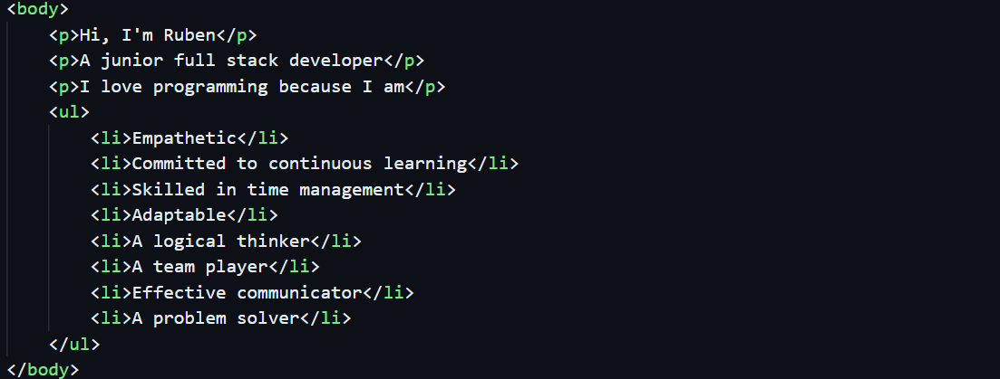

  

- 🌱 I’m currently learning **React, python, flask**

- 👯 I’m looking to collaborate on **any interesting project**

- 👨‍💻 All of my projects are available at [https://github.com/rubengargu?tab=repositories)

- 📫 How to reach me **rubengarciagut@gmail.com**

<h3 align="left">Connect with me:</h3>

<a mailto="rubengarciagut@gmail.com"><svg role="img" viewBox="0 0 24 24" xmlns="http://www.w3.org/2000/svg"><path d="M24 5.457v13.909c0 .904-.732 1.636-1.636 1.636h-3.819V11.73L12 16.64l-6.545-4.91v9.273H1.636A1.636 1.636 0 0 1 0 19.366V5.457c0-2.023 2.309-3.178 3.927-1.964L5.455 4.64 12 9.548l6.545-4.91 1.528-1.145C21.69 2.28 24 3.434 24 5.457z"/></svg></a>

<h3 align="left">Languages and Tools:</h3>

             

